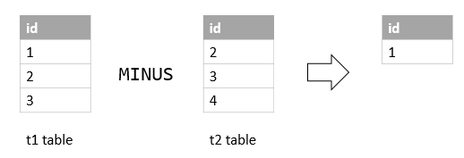
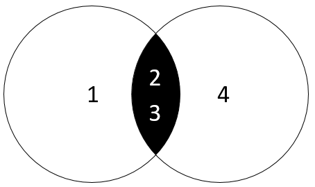

# UNION & simulate (MINUS / INTERSECT) Operations

* [UNION](#union) <br>
* [Simulate MINUS / EXCEPT](#simulate-minus--except) <br>
* [Simulate INTERSECT](#simulate-intersect) <br>

There are some basic rules that you must follow in general:
* First, the **number** and the **orders** of columns that appear in all `SELECT` statements must be the same.
* Second, the data types of columns must be the **same or convertible**.

### UNION
`UNION` operator allows you to combine two or more result sets of queries into a single result set.

```sql
SELECT column_list
UNION [DISTINCT | ALL]
SELECT column_list
UNION [DISTINCT | ALL]
SELECT column_list
...
```


**Example** <br>
We have those tables.
<pre>
  T1          T2
+----+      +----+
| id |      | id |
+----+      +----+
|  1 |      |  2 |
|  2 |      |  3 |
|  3 |      |  4 |
+----+      +----+
</pre>

**UNION with DISTINCT**
```sql
SELECT id
FROM t1
UNION
SELECT id
FROM t2;
```
<pre>
+----+
| id |
+----+
|  1 |
|  2 |
|  3 |
|  4 |
+----+
</pre>

**UNION with ALL**
```sql
SELECT id
FROM t1
UNION ALL
SELECT id
FROM t2;
```
<pre>
+----+
| id |
+----+
|  1 |
|  2 |
|  3 |
|  2 |
|  3 |
|  4 |
+----+
</pre>

**Important Notes:**

* MySQL `UNION` operator uses the column names of the **first** `SELECT` statement for labeling the columns in the output.
* If you want to sort the result of a union, you use an `ORDER BY` clause in the **last** `SELECT` statement.

### Simulate MINUS / EXCEPT
`MINUS` compares results of two queries and returns **distinct** rows from the first query that aren’t output by the second query.

```sql
SELECT column_list_1 FROM table_1
MINUS
SELECT columns_list_2 FROM table_2;
```


**Unfortunately, MySQL does not support `MINUS` operator. However, you can use the MySQL `LEFT JOIN` to simulate it.**

**Example** <br>
The same previous tables.

```sql
SELECT
    id
FROM
    t1
LEFT JOIN
    t2 USING (id)
WHERE
    t2.id IS NULL;
```



### Simulate INTERSECT
The `INTERSECT` operator is a set operator that returns only **distinct** rows of two queries or more queries.

```sql
(SELECT column_list
FROM table_1)
INTERSECT
(SELECT column_list
FROM table_2);
```



**Unfortunately, MySQL does not support `INTERSECT` operator. However, you can use the MySQL `INNER JOIN` or `SubQuery with IN` to simulate it.**

By `INNER JOIN`
```sql
SELECT DISTINCT
   id
FROM
    t1
INNER JOIN
   t2 USING(id);
```

By `SubQuery with IN`
```sql
SELECT DISTINCT
    id
FROM
    t1
WHERE
    id IN (SELECT
              id
           FROM
              t2);
```
