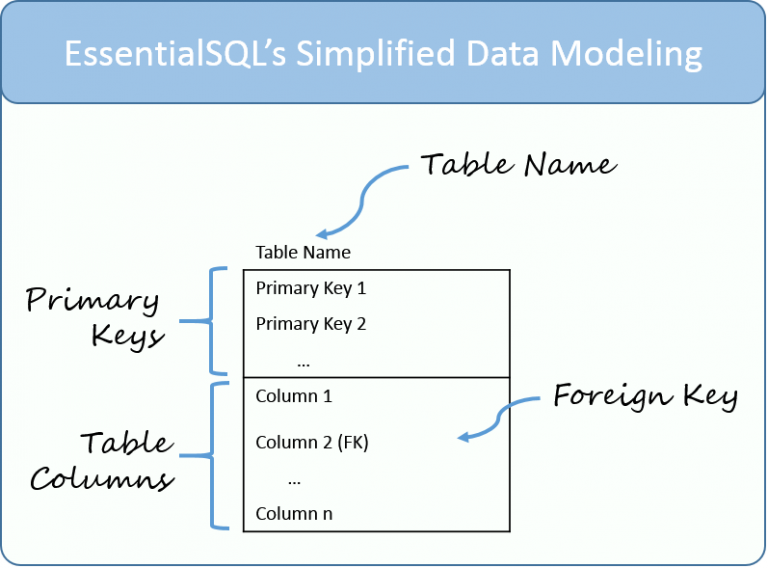
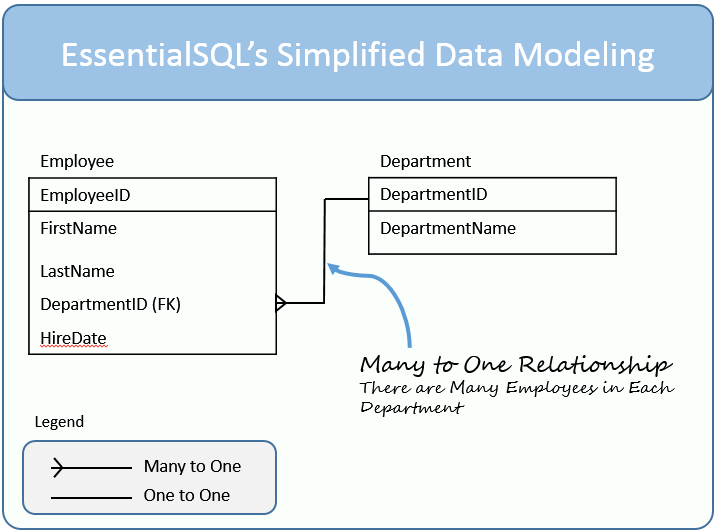

# Simple Data Modeling Concepts

* [Table Elements](#table-elements)
* [Table Relationships](#table-relationships)

### Table Elements

* **The Table Name:** which is located at the top of the table.
* **The Primary Keys:** Remember the primary keys uniquely identify each row in a table.  A table typically has one primary key, but can have more. When the key has more than one column, it is called a **compound key**.
* **Table Columns:** There can be one or more table columns.  To keep the diagrams simple, I don’t show the data types.  I may introduce those later when we focus on more comprehensive modeling.
* **Foreign Key:** This is a column or set of columns which match a primary key in another table.

### Table Relationships

Cardinality | Notation
---|---
zero or one-to-many | 0..*
one-to-many | 1..*
zero or one-to-one | 0..1
one-to-one | 1..1
