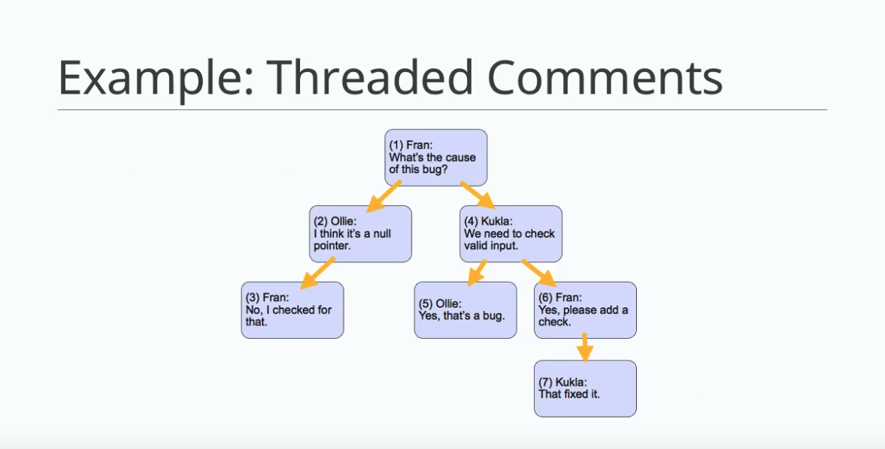

# Adjacency List In a Details

* [Table Structure](#table-structure)
* [Finding The Root Node](#finding-the-root-node)
* [Finding The Immediate Children of a Nodes](#finding-the-immediate-children-of-a-nodes)
* [Finding The Leaf Nodes](#finding-the-leaf-nodes)
* [Finding The All Tree Nodes](#finding-the-all-tree-nodes)

There are many ways to manage hierarchical data in MySQL and the `adjacency list model` may be the simplest solution.

**What is adjacency list ?**

We use adjacency list model when the value of one column corresponds to another row in the same table. When the correspondence is missing, it means that the row with the missing value should be considered as the `root` element.



**Pros**
* You will have a well designed database.
* You can get easily a node parent.

**Cons**
* It's so hard to get the all tree nodes.


### Table Structure


### Finding The Root Node
```sql
SELECT
    comment_id, author, comment
FROM
    comments
WHERE
    parent_id IS NULL;
```

### Finding The Immediate Children of a Nodes
```sql
SELECT
    comment_id, author, comment
FROM
    comments
WHERE
    parent_id = 1;
```
For other immediate nodes.
```sql
SELECT
    c1.comment_id, c1.author, c1.comment
FROM
    comments AS c1
LEFT JOIN
    comments AS c2
ON
    c2.parent_id = c1.comment_id AND c1.parent_id != 1
WHERE
    c2.comment_id IS NOT NULL
GROUP BY c1.comment_id;
```

### Finding The Leaf Nodes
```sql
SELECT
    c1.comment_id, c1.author, c1.comment
FROM
    comments AS c1
LEFT JOIN
    comments AS c2
ON
    c2.parent_id = c1.comment_id # It's a parent for a node.
WHERE
    c2.comment_id IS NULL; # if NULL, that means it's the last node.
```

### Finding The All Tree Nodes
```sql
SELECT * FROM comments C1
LEFT JOIN comments c2 ON (c2.parent_id = c1.comment_id)
LEFT JOIN comments c3 ON (c3.parent_id = c2.comment_id)
LEFT JOIN comments c4 ON (c4.parent_id = c3.comment_id)
LEFT JOIN comments c5 ON (c5.parent_id = c4.comment_id)
LEFT JOIN comments c6 ON (c6.parent_id = c5.comment_id)
...
```
