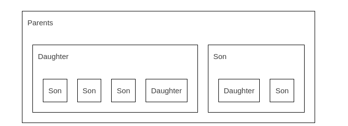
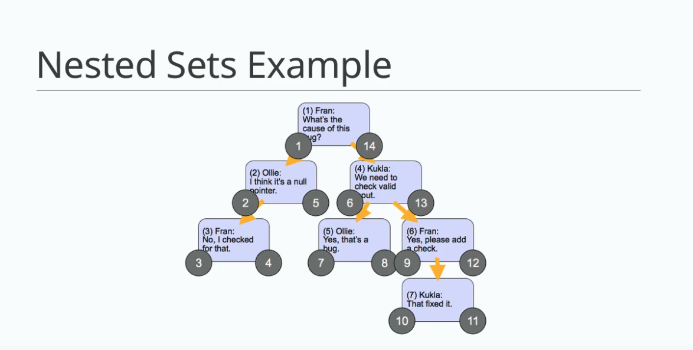
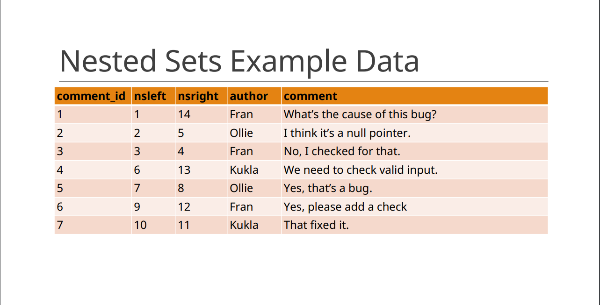

# Nested Sets

* [Table Structure](#table-structure)
* [Nested Sets Examples](#nested-sets-examples)

**Why the nested set is revolutionary ?**

It's because of its way of thinking about hierarchical data. In fact, it doesn't consider the data as a tree but as a nested set. Take a look of the picture and the SQL table with family members :


**How it works?**

Each comment encodes its descendants using two numbers:
* A comment’s `left number` is **less than** all numbers used by the comment’s descendants.
* A comment’s `right number` is **greater than** all numbers used by the comment’s descendants.
* A comment’s numbers are **between** all numbers used by the comment’s ancestors.


### Table Structure


**Pros**
* Single non-recursive query to get a tree or subtree.

**Cons**
* Complex updates to add or remove a node.
* Numbers are stored in a string no referential integrity.

### Nested Sets Examples
Query ancestors of comment #7:
```sql
SELECT
    ancestor.*
FROM
    comments child
JOIN
    comments ancestor
ON
    child.nsleft BETWEEN ancestor.nsleft AND ancestor.nsright
WHERE
    child.comment_id = 7;
```

Query subtree under comment #4:
```sql
SELECT
    descendant.*
FROM
    comments parent
JOIN
    comments descendant
ON
    descendant.nsleft BETWEEN parent.nsleft AND parent.nsright
WHERE
    parent.comment_id = 4;
```
