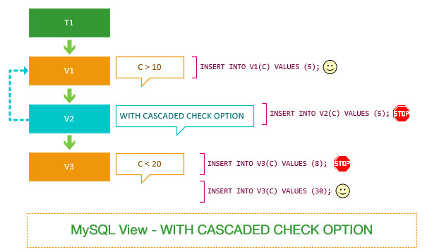

# WITH CHECK OPTION Clause

* [WITH CHECK OPTION Clause Example](#with-check-option-clause-example)
* [LOCAL and CASCADED](#local-and-cascaded)

`WITH CHECK OPTION` clause use to ensure consistency of the views. Consistency of the view means prevents user from updating or inserting rows that are not visible through the view.

The following illustrates the syntax of the `WITH CHECK OPTION` clause.
```sql
CREATE OR REPLACE VIEW view_name
AS
    select_statement
    WITH CHECK OPTION;
```
Notice that you put the semicolon (`;`) at the end of the `WITH CHECK OPTION` clause, not at the end of the `SELECT` statement defined the view.


### WITH CHECK OPTION Clause Example
```sql
CREATE OR REPLACE VIEW vps AS
    SELECT
        employeeNumber,
        lastname,
        firstname,
        jobtitle,
        extension,
        email,
        officeCode,
        reportsTo
    FROM
        employees
    WHERE
        jobTitle LIKE '%VP%'
WITH CHECK OPTION;
```

Now if the user try to update or insert any data that's not match the `WHERE` clause condition it'll give it error message.
```sql
Error Code: 1369. CHECK OPTION failed 'classicmodels.vps'
```

### LOCAL and CASCADED
When you create a view with the `WITH CHECK OPTION` clause, MySQL allows a view to checks the rules in the dependent views for consistency.

To determine the scope of check, MySQL provides two options: `LOCAL` and `CASCADED`. If you don’t specify the keyword explicitly in the `WITH CHECK OPTION` clause, MySQL uses `CASCADED` by default.

**WITH CASCADED CHECK OPTION**

When a view uses a `WITH CASCADED CHECK OPTION`, MySQL checks the rules of the view and also the rules of the underlying views recursively.



**WITH LOCAL CHECK OPTION**

When a view uses a `WITH LOCAL CHECK OPTION`, MySQL only checks the rules of the current view and it does not check the rules of the underlying views.


